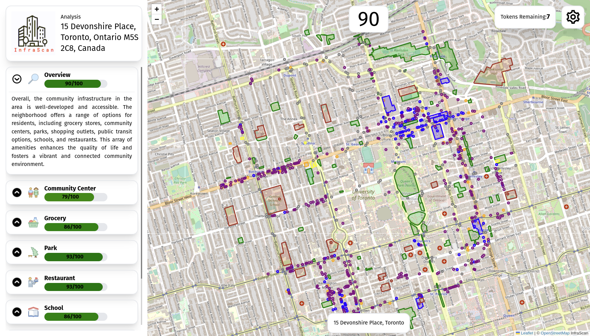

# Infrascan

## What is Infrascan?

Software for analyzing the community landscape in a neighbourhood.
Users can input addresses and the program will return a score for the surrounding community and neighborhood. This score will be based on the availability and relative distance of vital supportive infrastructure. It also uses text generation technologies to create a concise overview of the community infrastructure.

## Why?

Individuals in Canadian communities are experiencing a lack of community due to ineffective and inefficient urban planning and development. A study published in the Journal of Transport and Health found that vehicle-oriented neighborhoods in Canada are associated with decreased physical and mental health levels. This creates neighborhoods that are unable to foster connection, community, and economic growth. Studies have shown that disconnected communities are associated with health and social problems. Therefore, we must identify and analyze underutilized areas in existing neighborhoods to create more effective community spaces. To test our hypothesis, we are developing an algorithm that analyzes urban areas to identify and categorize problem areas. 

## Setup

You need an openai api key and a google maps api key to use the prototype.

- [backend](./backend/readme.md)
- [frontend](./frontend/readme.md)